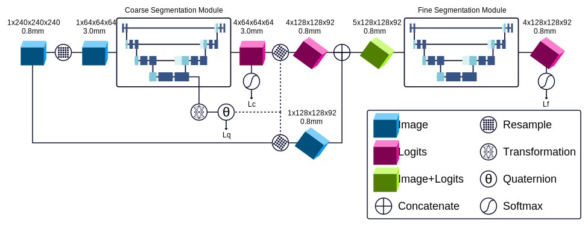

# CCTA Plane Prediction and Segmentation

This repository contains the code to reproduce results for the following conference paper, which has been accepted for publication in *Medical Imaging with Deep Learning* 2025:

    Vigneault DM, Manohar A, Hernandez A., *et al*, Cardiac Computed Tomography Angiography Plane Prediction and Comprehensive LV Segmentation. MIDL 2025. Salt Lake City, UT, USA.

Experiment files are found in `./experiments/midl-2025/`.  After modifying the paths in the experiment files to match the paths to input and output data folders, an experiment may be trained as follows:

    ./run-ccta-net.py \
        ./experiments/midl-2025/AtnY-ResY-CsdY-IndY-DirY-Hdn-128-128.toml \
        --train

The architecture is as follows:

Please see the above referenced article for further details.
